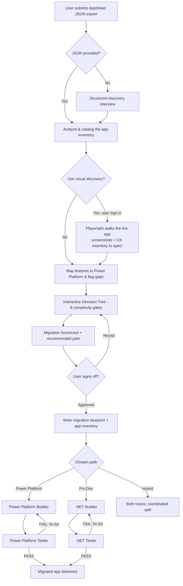

## How I used this

I applied this agentic migration workflow in a live enterprise setting to accelerate the
conversion of Google AppSheet apps to Microsoft Power Platform, as part of a broader
Google Workspace → Microsoft 365 transformation.

**Context.** During a large-scale digital workplace migration, several business-critical
AppSheet apps needed like-for-like equivalents on Power Platform. Rebuilding them by hand
would have taken weeks per app.

**What I did.**
- Ran the agent-driven assessment on exported AppSheet definitions to inventory tables, business logic, and integrations
- Used the decision-tree scorecard to select the right target per app (Power Platform vs. hybrid)
- Drove the automated build-and-test loop to generate like-for-like canvas apps, then validated them against the original app's UX

**Outcome.** App rebuild effort dropped from weeks to days while preserving functional
parity — freeing the team to focus on adoption rather than reconstruction. (Metrics
generalized here; specifics available on request.)

---

> Built on the open-source framework by [@comeredon](https://github.com/comeredon/appsheet-migrator).
> This fork documents my applied, real-world use of it.

# AppSheet → Microsoft Migration Agent

An agent-driven workflow that takes a **Google AppSheet app export (JSON)** and turns it into a migrated app on the Microsoft stack — **Power Platform (low-code)**, **.NET / Azure (pro-code)**, or a **Hybrid** — through an interactive, evidence-based assessment and an automated build/test loop.

You drop in a JSON export; the agents analyze it, walk you through a decision tree, recommend a target path, write a build blueprint, and then build and test the app against that blueprint.

---

## How it works (the flow)



**Step by step:**

1. **Intake** — The user submits an AppSheet JSON export (or, if none exists, answers a guided interview). Everything downstream is built from this inventory.
2. **Analyze** — The app is parsed and cataloged (tables, columns, expressions, automations, security, offline, AI features), and every export gap is challenged before moving on.
3. **Visual discovery (optional)** — Because Google exposes no API for an app's UX, the agent can drive the **live** app with the Playwright MCP to capture what the JSON can't: real screens, navigation, theme, and form layouts. The user is asked whether they want this and is told up front that **they'll log in themselves** (AppSheet requires Google sign-in; the agent never handles credentials). Screenshots and a UX inventory are written to `spec/visual-discovery/` and later used as the **design target** for the rebuild.
4. **Map** — Each AppSheet feature is mapped to its Power Platform equivalent, with ✅ / ⚠️ / ❌ confidence markers and an honest gap analysis.
5. **Decide** — An interactive **decision tree** scores eight complexity gates and produces a **Migration Scorecard** with a recommended path.
6. **Recommend & sign off** — The recommendation (Power Platform, Pro Dev, or Hybrid) is presented with architecture, phasing, licensing, and risks. Nothing is built until the user approves.
7. **Blueprint** — A handoff contract is written to `spec/` (chosen path, feature mapping, ordered build backlog, per-task acceptance criteria). If visual discovery ran, the blueprint references `spec/visual-discovery/` so design intent is part of the contract.
8. **Build → test loop** — The right builder implements the backlog; its paired tester validates against the acceptance criteria. On FAIL, the tester returns a fix list keyed to task IDs and the builder rebuilds. Repeat until PASS. On the Power Platform path, the builder matches the canvas screens to the captured screenshots for design fidelity.

---

## The decision chain (8 complexity gates)

The advisor scores each gate independently, shows a running total, and ends with a scorecard.

| Gate | Assesses |
|------|----------|
| 1. Data Complexity | Table count, relationships, key logic, virtual columns |
| 2. Business Logic | Expression complexity — lookups vs. multi-step / cross-table rules |
| 3. Offline | Online-only vs. full offline with sync & conflict resolution |
| 4. Integration | Number and type of external system integrations |
| 5. Security | Row-level, multi-dimensional, or multi-tenant access control |
| 6. AI / Advanced | OCR, prediction models, chatbots, geolocation, barcodes |
| 7. Scale & Performance | Concurrent users, record volume, delegation limits |
| 8. Builder Team | Maker/citizen developer vs. professional dev team |

Each gate scores **Low (0) → Medium (1) → High (2) → Blocker (3)** (Gate 8 is 0–2), for a total out of **23**.

**Recommendation rules:**

- **Power Platform** — total ≤ 6, no Blocker, and Offline & Scale both ≤ Medium.
- **Hybrid** — total 7–12, at most one Blocker (only on Integration or AI, which Azure Functions can absorb), and Data / Logic / Offline all ≤ High.
- **Pro Dev (.NET/Azure)** — total > 12, or any Blocker on Data / Logic / Offline / Security / Scale, or two+ Blockers anywhere, or a strong pro-dev team with an elevated score.

---

## The agents

The orchestrator hands work to single-purpose builder and tester agents via subagent calls. Work flows through shared artifacts in `spec/`, not by re-deriving context.

| Agent | Role |
|-------|------|
| **AppSheet Migration Specialist** | Orchestrator. Runs intake, analysis, mapping, decision tree, recommendation, writes the blueprint, and drives the build/test loop. |
| **Power Platform Builder** | Implements the low-code app (Dataverse + Power Apps + Power Automate) from the blueprint. |
| **Power Platform Tester** | Validates the Power Platform build against the acceptance criteria; returns PASS/FAIL + fix list. |
| **.NET Builder** | Implements the pro-code app (ASP.NET Core / Blazor / MAUI + EF Core + Azure SQL) from the blueprint, test-first. |
| **.NET Tester** | Validates the .NET build (build/startup/data/API/security); returns PASS/FAIL + fix list. |

Each agent is deliberately lean — persona + orchestration — with the substance held in reusable **skills** (analyzer, mapper, advisor, blueprint, build, validation, research protocol).

---

## Requirements

### Power Platform MCP (mandatory for the Power Platform path)

Canvas screens **must** be authored, compiled, and validated through the **Canvas Authoring MCP** — the builder never hand-writes unvalidated `.pa.yaml`. The server is declared in [.vscode/mcp.json](.vscode/mcp.json) as `canvas-authoring`, and it runs via `dnx` (the .NET tool runner).

**Install it on your machine to test:**

1. Install the **.NET 10 SDK** (or later) — `dnx` ships with it. Verify:
   ```powershell
   dnx --version
   ```
2. Open this repo in VS Code, open [.vscode/mcp.json](.vscode/mcp.json), and **Start** the `canvas-authoring` server (or reload the window). First run restores `Microsoft.PowerApps.CanvasAuthoring.McpServer` from NuGet automatically (`--yes --prerelease`).
3. Confirm the `canvasauthori` tools appear, then the builder runs `connect` to attach to your target Power Apps environment.

Because `.vscode/mcp.json` is committed, anyone who clones the repo gets the server definition — they only need the .NET SDK.

### Playwright MCP (optional — visual discovery of the source app)

Google exposes **no** API for an AppSheet app's UX or definition (the public AppSheet API is data-CRUD + admin/monitoring only), so the only way to capture what the app *looks like* is to drive the running app. The **Playwright MCP** does exactly that: it opens the live AppSheet app in a real browser, the user logs in, and the agent walks every view — taking screenshots and structured accessibility snapshots — then writes a UX inventory to `spec/visual-discovery/`. That inventory becomes the **design target** the Power Platform builder matches when authoring the canvas screens.

- **Opt-in** — the agent asks whether you want visual discovery; it's never forced.
- **You log in, not the agent** — AppSheet requires Google sign-in. The agent opens the app and **hands you the browser** to sign in; it never sees or handles your credentials.
- **Read-only by default** — the agent navigates and screenshots; it won't write data or fire destructive actions without explicit approval.
- **Role matters** — conditional formatting and row-level security depend on the signed-in role, so you pick which account best represents the app; coverage gaps are reported honestly.

The server is declared in [.vscode/mcp.json](.vscode/mcp.json) as `playwright` and runs via `npx @playwright/mcp@latest`, so **Node.js** is the only prerequisite. Open [.vscode/mcp.json](.vscode/mcp.json) and **Start** the `playwright` server (first run installs the package and a browser automatically).

### Microsoft Learn MCP (recommended)

Every capability, limit, or feature-equivalence claim is verified against live documentation via the **Microsoft Learn MCP** rather than trained knowledge. If it is unavailable, the agents pause instead of asserting unverified claims.

---

## Repository layout

```
.github/
  agents/         # The orchestrator + builder + tester agents
  skills/         # Reusable skills (analyzer, mapper, advisor, blueprint, build, validation, research)
.vscode/
  mcp.json        # Canvas Authoring MCP + Playwright MCP server definitions
AGENTS.md         # Shared conventions for all agents/skills
spec/             # Per-project outputs: inventory, blueprint, research, visual-discovery, test reports (git-ignored)
build/            # Per-project outputs: the generated migrated app (git-ignored)
```

`spec/` and `build/` are **per-project** and are git-ignored — the committed repo is a reusable template. When you run a migration, the agents populate these folders locally.

---

## Getting started

1. Ensure the prerequisites above are installed (.NET 10 SDK for the Power Platform MCP; Node.js if you want Playwright visual discovery; Microsoft Learn MCP available).
2. Open the repo in VS Code and start the `canvas-authoring` MCP server (and the `playwright` server if you plan to use visual discovery).
3. Invoke the **AppSheet Migration Specialist** agent and provide the path to your AppSheet JSON export (or ask to be interviewed if you don't have one).
4. Work through the assessment — including optional visual discovery of your live app — approve the recommended path, and let the build/test loop run to a PASS.

---

## Conventions

All agents and skills follow the shared standards in [AGENTS.md](AGENTS.md): one topic at a time, cite the source behind every claim, use ✅ / ⚠️ / ❌ confidence markers, be honest about gaps, verify external claims against live sources, and end every message with a clear next step.
